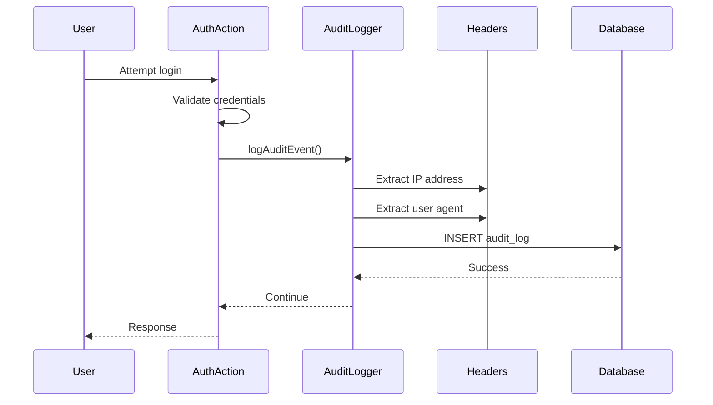

# Audit Logging and Security Monitoring Design Document

**Issue:** #19 - [MEDIUM] Implement Audit Logging and Security Monitoring
**Date:** 2026-01-26
**Severity:** MEDIUM
**Status:** Design Phase

## Overview

Implement audit logging focused on authentication events to enable forensic analysis, detect security incidents, and meet compliance requirements (SOC 2, GDPR, PCI DSS).

## Problem Statement

The application lacks audit logging for security-relevant events, meaning:
- No forensic trail after security breaches
- Cannot detect suspicious authentication patterns
- Compliance violations (SOC 2 CC7.2, GDPR Article 30, PCI DSS Requirement 10)
- No visibility into failed login attempts across IPs
- Cannot trace unauthorized actions

### Critical Missing Events
- Login attempts (success/failure)
- Logout events
- Session creation and destruction
- Unauthorized access attempts

## Solution Architecture

### Approach: PostgreSQL-Based Audit Log with Utility

Create a dedicated `audit_log` table and a reusable `logAuditEvent()` utility. This MVP implementation focuses on authentication events only, with future expansion planned for transaction/account/category operations.

### Components

1. **Audit Log Table** (database schema)
   - Columns: id, user_id, action, resource, resource_id, success, ip_address, user_agent, details, created_at
   - Indexes: created_at, user_id, success for efficient querying
   - Immutable: No UPDATE/DELETE (append-only for forensic integrity)

2. **Audit Logger Utility** (`lib/audit/logger.ts`)
   - `logAuditEvent(event: AuditEvent)` function
   - Automatic IP and user agent extraction
   - Secure error logging on failures (don't break authentication)
   - JSONB `details` field for flexible context

3. **Integration Points** (authentication actions)
   - `lib/actions/auth.ts` - login (success/failure), logout
   - Session changes - create/destroy
   - Future: transactions, accounts, categories

### Database Schema

```sql
CREATE TABLE audit_log (
  id SERIAL PRIMARY KEY,
  user_id INTEGER REFERENCES users(id),
  action VARCHAR(50) NOT NULL,
  resource VARCHAR(50) NOT NULL,
  resource_id INTEGER,
  success BOOLEAN NOT NULL,
  ip_address VARCHAR(45),
  user_agent TEXT,
  details JSONB,
  created_at TIMESTAMP DEFAULT NOW()
);

CREATE INDEX idx_audit_log_created_at ON audit_log(created_at DESC);
CREATE INDEX idx_audit_log_user_id ON audit_log(user_id);
CREATE INDEX idx_audit_log_success ON audit_log(success, created_at);
```

### Event Schema

**Authentication events:**
| Action | Resource | Success? | Description |
|--------|----------|----------|-------------|
| `login` | authentication | true | Successful authentication |
| `login_failed` | authentication | false | Failed login attempt |
| `logout` | authentication | true | User logout |
| `session_created` | session | true | Session establishment |
| `session_destroyed` | session | true | Session termination |

**Sample audit entry:**
```json
{
  "id": 1,
  "user_id": 123,
  "action": "login_failed",
  "resource": "authentication",
  "resource_id": null,
  "success": false,
  "ip_address": "203.0.113.42",
  "user_agent": "Mozilla/5.0...",
  "details": {
    "username": "admin",
    "reason": "invalid_password"
  },
  "created_at": "2026-01-26T10:30:15.123Z"
}
```

### Data Flow



### Security Properties

**What audit logging provides:**
- ✅ Forensic trail after breaches
- ✅ Detection of failed login patterns per IP
- ✅ Detection of distributed brute-force attacks
- ✅ Compliance evidence (SOC 2, GDPR, PCI DSS)
- ✅ Account takeover detection (unusual IPs)
- ✅ Session hijacking detection (multiple sessions)

**Design security:**
- Append-only table (no UPDATE/DELETE)
- Audit logging failures logged but don't break authentication
- IP extraction from x-forwarded-for for proxy support
- User agent logging to detect automation
- Separation of concerns (loose coupling)

### Compliance Mapping

**SOC 2:**
- CC6.3: Monitor for anomalies and investigate
- CC7.2: Periodically test system logs for evidence of improper use

**GDPR:**
- Article 30: Records of processing activities
- Article 33: Notification of personal data breach to supervisory authority

**PCI DSS:**
- Requirement 10.1: Implement audit trails
- Requirement 10.2: Audit trail components (user ID, action, date/time)
- Requirement 10.2.3: Indication of success/failure

### Privacy Considerations

**IP addresses:** Personally Identifiable Information (PII) in GDPR
- Store in database for forensic purposes
- Retention policy needed (e.g., 90 days or 1 year)
- Consider anonymization/hash for long-term storage

**User agents:** Generally not PII
- Contains browser version, OS details
- Used to detect automation
- Lower privacy concern

**Details field:** May contain usernames, transaction amounts
- Contains business data, not necessarily PII
- Handle according to data classification policy

## Implementation Scope

### In Scope (MVP)
1. Create `audit_log` table with indexes
2. Create `logAuditEvent()` utility in `lib/audit/logger.ts`
3. Integrate into `lib/actions/auth.ts` (login/logout)
4. Log session creation/destruction
5. Unit tests for audit logger
6. E2E tests for authentication events
7. Documentation and queries for security monitoring

### Out of Scope
- Transaction CRUD events
- Account/category CRUD events
- Configuration changes
- Real-time alerts
- Admin dashboard for viewing logs
- Log aggregation system (Sentry, Datadog)
- Automatic log rotation/archiving

### Future Expansion

After MVP, extend audit logging to:
- Transaction create/update/delete
- Account create/update/delete
- Category create/update/delete
- Permission changes
- System configuration updates
- API rate limit violations
- Failed authorization attempts (not just authentication)

## Testing Strategy

### Unit Tests
- `logAuditEvent()` inserts correct record into database
- IP address extraction from headers works
- IP extraction from x-forwarded-for for proxy support
- User agent extraction from headers works
- Database errors logged to secure handler (don't throw)
- All required fields present in inserted record

### E2E Tests
- Successful login creates audit log entry
- Failed login creates audit log entry with success=false
- Logout creates audit log entry
- Audit entries contain correct user_id, IP, user_agent
- Multiple authentication attempts create multiple entries
- Database query verifies audit log structure
- IP addresses extracted correctly through proxy

### Security Tests
- Audit log cannot be modified (no UPDATE/DELETE allowed)
- Audit logging failures don't break authentication
- IP spoofing attempts are handled gracefully
- SQL injection prevented in details field (parametrized queries)

## Migration and Deployment

### Database Migration

**File:** `lib/db/migrations/003_add_audit_log.sql`

No data migration required - purely additive schema.

**Deployment steps:**
1. Review migration SQL
2. Test migration in staging database
3. Deploy to staging
4. Verify table created with proper indexes
5. Test audit logging on staging
6. Monitor log growth rate
7. Deploy to production

### Rollback Plan

If issues arise:

1. **Audit logging causing performance issues:**
   - Temporarily comment out `logAuditEvent()` calls
   - Keep table (no impact if unused)

2. **Compliance concerns:**
   - Audit logs already created - privacy issue
   - Can anonymize/sanitize data via SQL
   - Or drop table: `DROP TABLE audit_log CASCADE;`

3. **Complete removal:**
   - Drop table and revert code changes
   - Audit logs lost (recreated from fresh start)

### Retention Policy (Future Enhancement)

```sql
-- Archive old logs (e.g., older than 90 days)
CREATE TABLE audit_log_archive AS
SELECT * FROM audit_log WHERE created_at < NOW() - INTERVAL '90 days';

DELETE FROM audit_log WHERE created_at < NOW() - INTERVAL '90 days';

-- Or drop old logs (if not needed for compliance)
DELETE FROM audit_log WHERE created_at < NOW() - INTERVAL '90 days';
```

## Monitoring and Alerting

### Queries for Security monitoring

**Failed login attempts per IP (last 24h):**
```sql
SELECT
  ip_address,
  COUNT(*) as failed_attempts,
  MAX(created_at) as last_attempt
FROM audit_log
WHERE
  action = 'login_failed'
  AND created_at > NOW() - INTERVAL '24 hours'
GROUP BY ip_address
HAVING COUNT(*) > 10
ORDER BY COUNT(*) DESC;
```

**Failed login attempts per user (last 24h):**
```sql
SELECT
  u.username,
  COUNT(*) as failed_attempts,
  MAX(al.created_at) as last_attempt
FROM audit_log al
JOIN users u ON al.user_id = u.id
WHERE
  al.action = 'login_failed'
  AND al.created_at > NOW() - INTERVAL '24 hours'
GROUP BY u.username
HAVING COUNT(*) > 5
ORDER BY COUNT(*) DESC;
```

**Successful logins from unusual locations:**
```sql
SELECT
  u.username,
  al.ip_address,
  COUNT(*) as logins,
  MAX(al.created_at) as last_login
FROM audit_log al
JOIN users u ON al.user_id = u.id
WHERE
  al.action = 'login'
  AND al.success = true
  AND al.created_at > NOW() - INTERVAL '7 days'
GROUP BY u.username, al.ip_address
ORDER BY COUNT(*) DESC;
```

### Metrics to Track

- Failed login rate (percentage of total attempts)
- Successful login rate
- Audit log growth rate (rows/day)
- Alert on: >50 failed logins per IP in 24h
- Alert on: >10 failed logins per user in 24h

## Success Criteria

- ✅ Audit log table created with appropriate indexes
- ✅ All authentication events logged (login, logout, login_failed)
- ✅ Audit entries contain IP address, user agent, details
- ✅ Audit logging failures handled gracefully
- ✅ All existing tests pass
- ✅ New audit logger tests pass
- ✅ New E2E tests pass
- ✅ Production deployment with monitoring
- ✅ Audit logs queryable for forensics

## References

- Design Document: `docs/plans/2026-01-26-audit-logging-design.md`
- Issue: #19 - [MEDIUM] Implement Audit Logging and Security Monitoring
- CWE-778: Insufficient Logging
- OWASP Logging Cheat Sheet: https://cheatsheetseries.owasp.org/cheatsheets/Logging_Cheat_Sheet.html
- NIST SP 800-92: Guide to Computer Security Log Management
