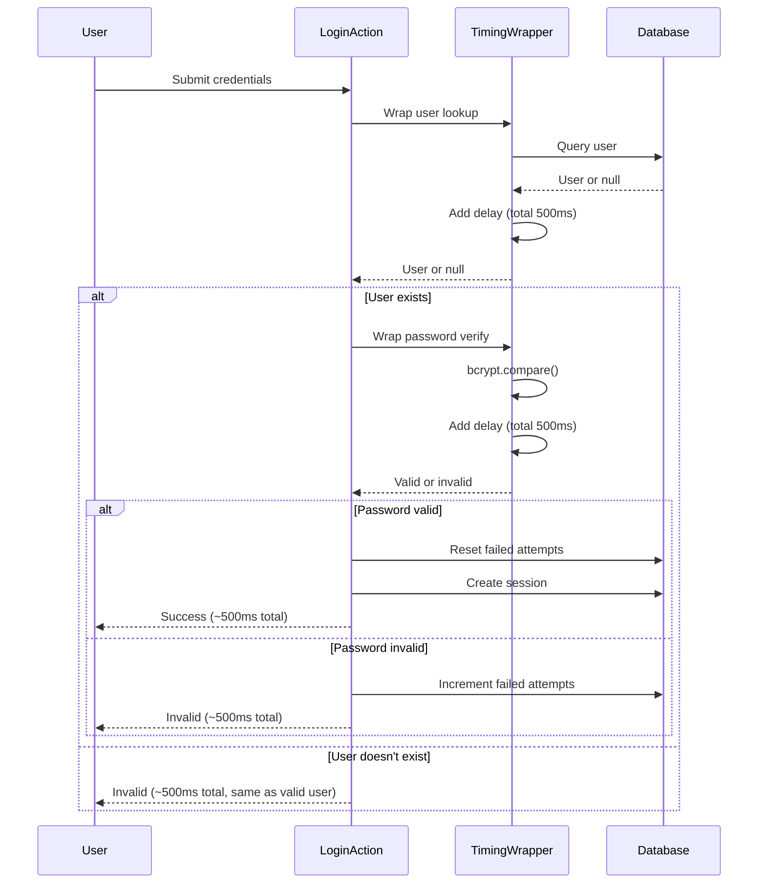
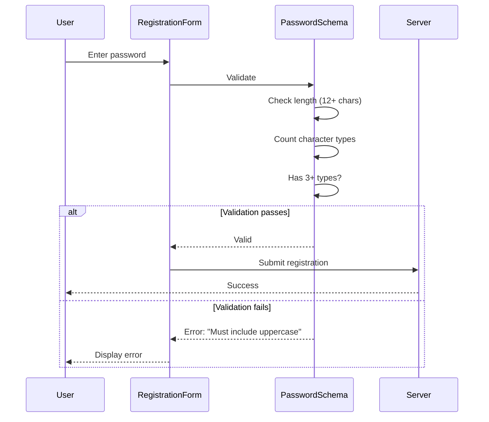

# Authentication Security Improvements Design Document

**Issue:** #16 - [HIGH] Authentication Security Improvements
**Date:** 2026-01-26
**Severity:** HIGH
**Status:** Design Phase

## Overview

Implement two critical authentication security enhancements: timing attack prevention through constant-time delays, and strong password complexity requirements. These improvements protect against username enumeration and weak credential attacks.

## Problem Statement

### 1. User Enumeration Vulnerability (CWE-203)
**Location:** `lib/actions/auth.ts:30-43`

The login function provides different response times for valid vs. invalid usernames, enabling timing-based username enumeration attacks.

**Attack scenario:**
```bash
# Attacker measures response time differences
time curl -X POST http://app.com/login -d "username=alice&password=wrong"  # Valid user
time curl -X POST http://app.com/login -d "username=bob&password=wrong"    # Invalid user

# Different response times reveal which usernames exist
```

### 2. Weak Password Requirements (CWE-521)
**Location:** `lib/validations/auth.ts:3-6`

Password validation only checks non-empty, allowing weak passwords that are easily compromised via brute-force attacks.

**Vulnerable passwords currently allowed:**
- `password` (8 chars, common)
- `123456` (numeric, easily guessed)
- `qwerty` (common pattern)
- `admin123` (only lowercase and numbers)

## Solution Architecture

### Approach 1: Constant-Time Delay Wrapper

Wrap password verification in a constant-time delay function that normalizes response time across all login attempts, eliminating the timing-based vector for username enumeration.

**Mechanism:**
1. Measure execution time of database query and password verification
2. Add artificial delay to ensure total time equals fixed target (e.g., 500ms)
3. Return after target duration regardless of actual processing time

**Attack prevention:**
- Valid user + invalid password: ~500ms
- Invalid user: ~500ms
- Valid user + valid password: ~500ms
- Attacker cannot distinguish based on timing

### Approach 2: Password Complexity Requirements

Enhance password validation to require:
- **Minimum length:** 12 characters
- **Character types:** At least 3 of 4 types:
  - Uppercase letters (A-Z)
  - Lowercase letters (a-z)
  - Numbers (0-9)
  - Special characters (!@#$%^&*...)

**Example valid passwords:**
- `Password123!` ✓ (12 chars, upper, lower, number, special)
- `mySecretPass456` ✓ (14 chars, upper, lower, number)
- `GoodP@ss!23` ✓ (12 chars, upper, lower, special, number)

**Example invalid passwords:**
- `password` ✗ (8 chars, too short)
- `Password1` ✗ (only 2 types: upper, lower, number)
- `ALLCAPS123!` ✗ (only 3 types: upper, number, special, no lower)

### Components

1. **Timing-Safe Wrapper** (`lib/auth/timing-safe.ts`)
   - `wrapWithConstantTime<T>(operation, targetDurationMs)` function
   - Returns Promise<T> after enforced delay
   - Configurable target duration via environment

2. **Enhanced Password Schema** (`lib/validations/auth.ts`)
   - `passwordSchema` with Zod refinements
   - Separate schemas for login (no complexity) vs registration (with complexity)
   - Clear, specific error messages

3. **Integration** (`lib/actions/auth.ts`)
   - Wrap user lookup and password verification
   - Maintain existing authentication flow
   - No breaking changes for existing users

### Data Flow

**Login flow with timing protection:**


**Password validation flow (registration):**


### Security Properties

**Before:**
- ❌ Response times reveal valid vs. invalid usernames
- ❌ Weak passwords allowed (brute-force vulnerable)
- ❌ No password complexity requirements

**After:**
- ✅ Constant response time prevents username enumeration
- ✅ Strong passwords required (minimum security baseline)
- ✅ Generic error messages prevent information leakage
- ✅ Configurable delay for environment tuning

### Password Complexity Rules

| Requirement | Valid | Example ✓ | Example ✗ |
|-------------|-------|-----------|-----------|
| Length | ≥ 12 chars | `MyPass123!` | `short1!` ✓ (too short) |
| Uppercase | Required (1 of 3+ types) | `PASSword123` | `password123` (no uppercase) |
| Lowercase | Required (1 of 3+ types) | `passWORD123` | `PASSWORD123` (no lowercase) |
| Number | Required (1 of 3+ types) | `Password111!` | `Password!!!` (no number) |
| Special | Optional (1 of 3+ types) | `Password123!` | `Password123` (no special, acceptable) |
| Type Count | ≥ 3 of 4 types | `Password123` (3 types) ✓ | `password123` (2 types) ✗ |

**Why 3 of 4 instead of all 4:**
- Better user experience
- Still provides strong security (12 chars + 3 types = massive search space)
- Accepts memorable passwords like `MySecret456` without special chars
- Reduces user frustration and support tickets

### Timing Configuration

| Environment | Target Delay | Rationale |
|-------------|--------------|-----------|
| Production | 500ms | Sufficient to normalize, acceptable UX |
| Development | 100-200ms | Faster iteration, still prevents timing |
| Testing | 0ms | Instant execution for test suite |

Configurable via `AUTH_CONSTANT_TIME_DELAY_MS` environment variable.

### Migration and Deployment

**No database changes required** - these are code-only improvements.

**Password complexity applies to:**
- New user registrations
- Password changes
- Password resets

**Existing passwords:**
- Remain valid (no retroactive enforcement)
- Users prompted to improve strength on next change
- Can implement forced password change in future iteration (optional)

### Limitations and Trade-offs

| Limitation | Mitigation |
|------------|------------|
| 500ms delay affects UX | Acceptable tradeoff for security; can reduce to 200ms |
| Password complexity may frustrate users | 3-of-4 rule balances security and usability |
| Only prevents timing attacks, not enumeration | Combined with generic error messages |
| Existing weak passwords not forced reset | Optional future enhancement |

## Implementation Scope

### In Scope
1. Create `timing-safe.ts` wrapper module
2. Enhance `passwordSchema` in `lib/validations/auth.ts`
3. Integrate timing protection into `lib/actions/auth.ts`
4. Add `registerSchema` for new registrations
5. Unit tests for timing wrapper and password schema
6. E2E tests for timing consistency
7. Documentation and migration guide

### Out of Scope
- Forced password change for existing users
- Password history (prevent reuse)
- Password expiration policy
- Password strength meter UI
- haveibeenpwned integration
- Adaptive timing (shorter for trusted IPs)

## Testing Strategy

### Unit Tests
- `wrapWithConstantTime()` adds correct delay (±10%)
- Delay works for quick operations
- Delay works for slow operations
- Delay zero in test environment
- Password schema rejects < 12 chars
- Password schema rejects < 3 character types
- Password schema accepts 12+ chars with 3+ types
- Specific error messages for each failure

### E2E Tests
- Login timing consistent (valid user vs. invalid user)
- Login timing consistent (valid password vs. invalid)
- 500ms ± 100ms tolerance for all login attempts
- Form validation shows specific password errors
- Registration accepts strong passwords
- Existing users can login without password change

### Integration Tests
- Multiple login attempts with consistent timing
- Measure actual response times in various scenarios
- Verify no timing > 600ms or < 400ms (in production)

## Alternatives Considered

### Option 1: Always Run Bcrypt with Dummy Hash
- **Pros:** No artificial delay
- **Cons:** Still ~200ms per login, adds dummy hash constant
- **Rejected:** Constant-time delay provides more control and predictability

### Option 2: All 4 Character Types Required
- **Pros:** Strongest password policy
- **Cons:** Frustrating UX, users struggle with special chars
- **Rejected:** 3-of-4 balances security and usability

### Option 3: No Timing Protection (Current State)
- **Pros:** Maximum UX speed
- **Cons:** Username enumeration vulnerability
- **Rejected:** High security risk outweighs 500ms delay

## Success Criteria

- ✅ All login attempts complete in ~500ms (±20%)
- ✅ Response times indistinguishable across scenarios
- ✅ Passwords < 12 characters rejected
- ✅ Passwords with < 3 character types rejected
- ✅ Specific error messages guide user corrections
- ✅ All existing tests pass
- ✅ New timing tests pass
- ✅ New password validation tests pass
- ✅ Existing users unaffected
- ✅ Production deployment with monitoring

## Rollback Plan

If issues arise:

1. **UX complaints about delay:** Reduce `AUTH_CONSTANT_TIME_DELAY_MS` to 200ms or 100ms
2. **Password complexity issues:** Relax to 2-of-4 or 12+ chars only
3. **Complete rollback:** Remove timing wrapper, revert password schema

No database changes, so rollback is non-destructive. Existing passwords remain valid.

## References

- Issue: #16 - [HIGH] Authentication Security Improvements
- CWE-203: Observable Discrepancy
- CWE-521: Weak Password Requirements
- RFC 7664 (PBKDF2 for password hashing)
- OWASP Authentication Cheat Sheet: https://cheatsheetseries.owasp.org/cheatsheets/Authentication_Cheat_Sheet.html
- OWASP Password Storage Cheat Sheet: https://cheatsheetseries.owasp.org/cheatsheets/Password_Storage_Cheat_Sheet.html
