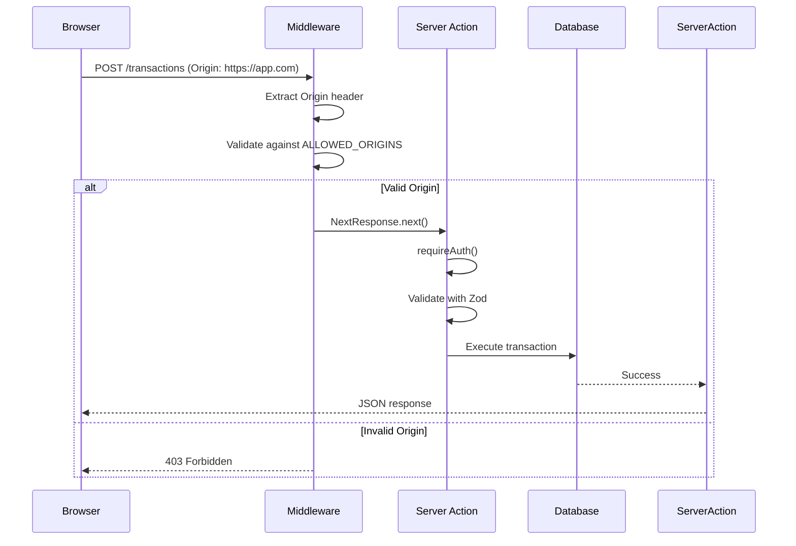

# CSRF Protection Design Document

**Issue:** #12 - [CRITICAL] Missing CSRF Protection on State-Changing Operations
**Date:** 2026-01-26
**Severity:** CRITICAL
**Status:** Design Phase

## Overview

Implement Cross-Site Request Forgery (CSRF) protection using Origin and Referer header verification in Next.js middleware. This prevents malicious websites from triggering state-changing operations on users' behalf without requiring session storage or client-side JavaScript tokens.

## Problem Statement

Next.js Server Actions lack built-in CSRF protection, making all state-changing operations (login, transaction CRUD, account modifications) vulnerable to CSRF attacks. An attacker can force authenticated users to perform unwanted actions by embedding malicious forms on controlled websites.

### Attack Scenario

```html
<!-- Attacker's malicious website -->
<form id="evil" action="https://victim-app.com" method="POST">
  <input type="hidden" name="amount" value="-10000">
  <input type="hidden" name="payee" value="Attacker">
</form>
<script>document.getElementById('evil').submit();</script>
```

Without CSRF protection, this form would execute on the victim's session, creating unauthorized transactions.

## Solution Architecture

### Approach: Origin Header Verification

Validate that HTTP `Origin` and `Referer` headers match trusted domains before processing state-changing requests. This leverages browser-enforced same-origin policies without introducing token complexity.

### Components

1. **Middleware Layer** (`middleware.ts`)
   - Intercepts all requests before Server Actions
   - Validates Origin/Referer headers for POST/PUT/DELETE/PATCH
   - Returns 403 for invalid origins
   - Bypasses validation for safe methods (GET, HEAD, OPTIONS)

2. **Configuration** (Environment Variables)
   - `ALLOWED_ORIGINS`: Comma-separated list of trusted domains
   - `NEXT_PUBLIC_SITE_URL`: Fallback for automatic configuration
   - Supports production and development environments

3. **Error Handling**
   - Generic 403 error message to prevent information leakage
   - Detailed logging in development for debugging
   - Sanitized logging in production

### Data Flow



### Security Properties

**Pre-middleware vulnerabilities:**
- ✅ Prevents cross-site attacks from malicious websites
- ✅ No session storage required (stateless)
- ✅ Works with existing authentication (`requireAuth()`)
- ✅ Compatible with Server Actions

**Defense in depth:**
- Origin header validation (primary)
- `sameSite: 'strict'` cookies (complementary)
- `httpOnly` cookies (XSS protection)
- Session authentication (authorization)

### Limitations and Mitigations

| Limitation | Mitigation |
|------------|------------|
| Origin header omitted by some user agents | Require Referer as fallback |
| Attacker controls victim's browser plugin | Auth layer still requires valid session |
| Spoofed headers on same-origin requests | Not possible due to browser enforcement |

## Implementation Scope

### In Scope
- Create `middleware.ts` with Origin/Referer validation
- Add environment variable documentation
- Add error handling and logging
- Unit tests for middleware logic
- E2E tests for cross-site attack scenarios
- Update deployment documentation

### Out of Scope
- Token-based CSRF implementation (alternative approach)
- Client-side JavaScript modifications
- Database schema changes
- Breaking changes to existing Server Actions

## Testing Strategy

### Unit Tests
- Valid Origin returns `NextResponse.next()`
- Invalid Origin returns 403
- Missing Origin with valid Referer passes
- GET/HEAD/OPTIONS bypass validation
- Empty ALLOWED_ORIGINS skips validation

### Integration Tests
- Simulated cross-site attacks using Playwright
- Normal application flow verification
- Header edge cases (missing, malformed, etc.)

### E2E Tests
- All existing E2E tests pass without modification
- Legitimate form submissions work correctly
- Authentication flow uninterrupted

## Migration Plan

### Pre-deployment
1. Review current environment variables
2. Add `ALLOWED_ORIGINS` to staging environment
3. Validate configuration with test requests

### Deployment
1. Deploy middleware to staging
2. Run full test suite
3. Monitor logs for validation failures
4. Deploy to production with `ALLOWED_ORIGINS` configured

### Post-deployment
1. Monitor 403 error rates
2. Review authentication logs for anomalies
3. Validate normal user operations unaffected

## Alternatives Considered

### Option 1: CSRF Token Middleware
- **Pros:** Strongest CSRF protection, defense against more attacks
- **Cons:** Requires session storage, client-side JavaScript, more complex
- **Rejected:** Overkill for use case, increases complexity

### Option 2: SameSite=Strict Only
- **Pros:** Simplest implementation, no middleware
- **Cons:** Relies solely on cookie attribute, less defense-in-depth
- **Rejected:** Single point of failure, less robust

### Option 3: Multi-Layer Protection
- **Pros:** Best-in-class security
- **Cons:** Maximum complexity, token management overhead
- **Rejected:** Origin validation + existing cookies sufficient

## Success Criteria

- ✅ All state-changing Server Actions protected by Origin validation
- ✅ Cross-site attacks blocked before execution
- ✅ Normal application operation uninterrupted
- ✅ All existing tests pass
- ✅ New middleware tests pass
- ✅ Production deployment without downtime

## Rollback Plan

If issues arise:

1. **Immediate:** Remove or rename `middleware.ts` to disable CSRF validation
2. **Alternative:** Set `ALLOWED_ORIGINS` to empty string in environment (safe default)
3. **Permanent:** Revert commit via `git revert <commit-hash>`

No database changes required, so rollback is non-destructive.

## References

- OWASP CSRF Prevention Cheat Sheet: https://cheatsheetseries.owasp.org/cheatsheets/Cross-Site_Request_Forgery_Prevention_Cheat_Sheet.html
- Next.js Middleware Documentation: https://nextjs.org/docs/app/building-your-application/routing/middleware
- RFC 6454 (The Web Origin Concept): https://datatracker.ietf.org/doc/html/rfc6454
