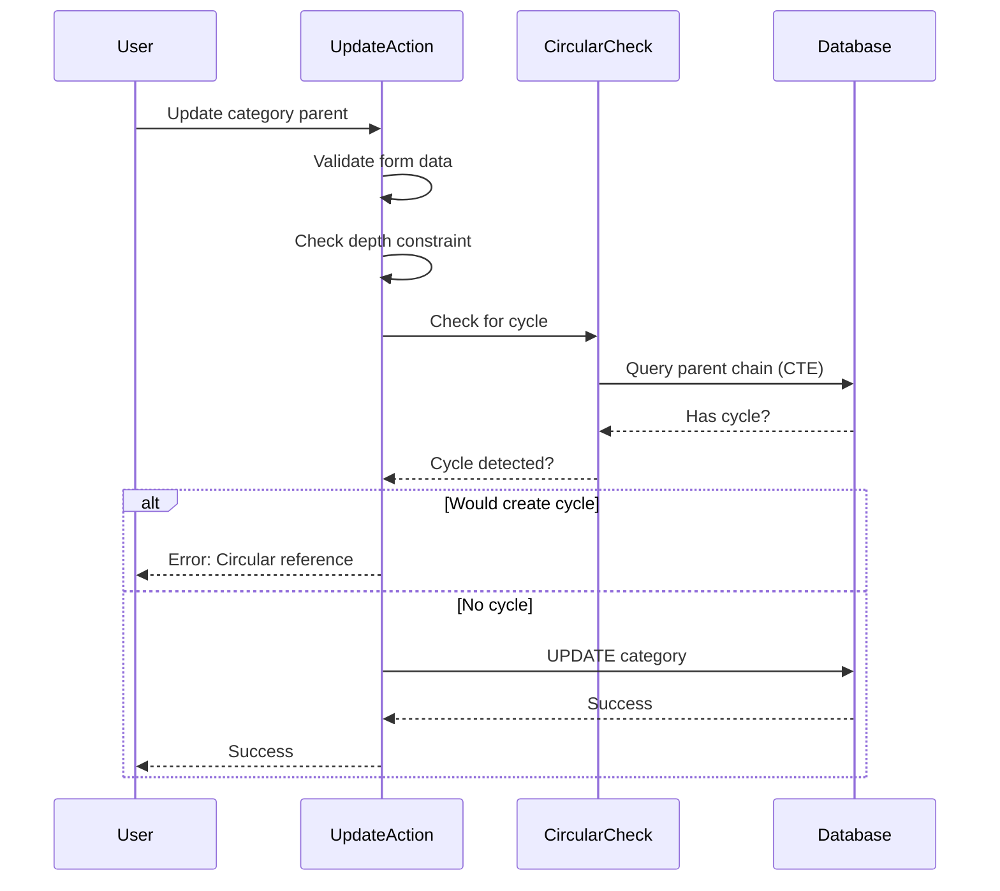
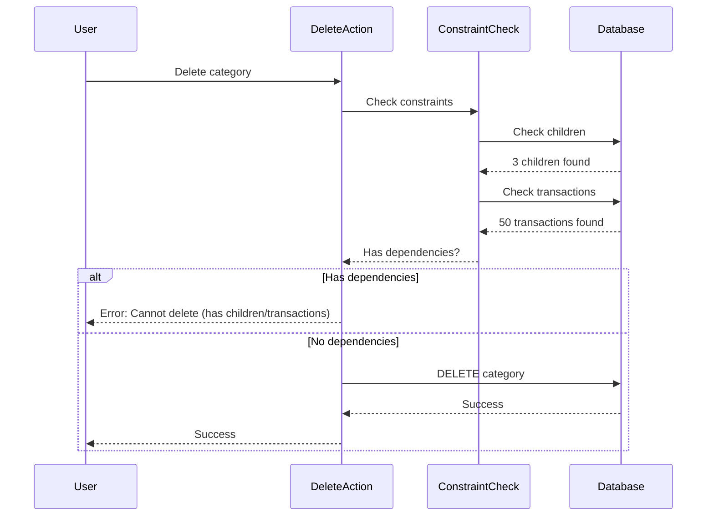

# Data Integrity Improvements Design Document

**Issue:** #21 - [MEDIUM] Data Integrity and Validation Issues
**Date:** 2026-01-26
**Severity:** MEDIUM
**Status**: Design Phase

## Overview

Implement data integrity protections for categories to prevent circular references and accidental data loss during deletions.

## Problem Statement

### 1. Circular Reference Vulnerability (CWE-665)

**Location:** `lib/actions/categories.ts:60-108`

The category update action doesn't check for circular parent-child relationships, potentially breaking the category tree.

**Attack scenario:**
```
Category A (ID: 1, parent: null)
  └─ Category B (ID: 2, parent: 1)
      └─ Category C (ID: 3, parent: 2)

Attacker tries: Update Category A → parent = Category C
Result: A → B → C → A (circular!)
Consequence: Category tree becomes invalid, infinite loops in queries
```

### 2. Orphan Deletion Without Warning

**Location:** `lib/actions/categories.ts:110-128`

Categories deleted with CASCADE without warning, potentially deleting child categories and transactions:

**Accidental deletion scenario:**
```
Category: Housing (ID: 6)
  ├─ Rent (ID: 8, 100 transactions)
  ├─ Mortgage (ID: 9, 50 transactions)
  └─ Insurance (ID: 10, 25 transactions)

User deletes "Housing"
Result: Deletes 150 transactions without confirmation
Consequence: Accidental data loss, user frustration
```

### 3. No Concurrent Modification Protection

Multiple users can modify the same category simultaneously without detection, leading to lost updates.

## Solution Architecture

### Approach: Two-Layer Validation

1. **Circular Reference Prevention:**
   - Validate before database update
   - Recursive CTE traverses parent chain
   - Reject updates that create cycles

2. **Orphan Check Before Deletion:**
   - Query for child categories
   - Query for transactions using category
   - Return error with counts if dependencies exist

### Components

1. **Circular Reference Checker** (`lib/db/categories.ts`)
   - `wouldCreateCircularReference(categoryId, newParentId)` function
   - Recursive CTE traversal
   - Returns boolean

2. **Deletion Constraint Checker** (`lib/db/categories.ts`)
   - `checkCategoryDeletionConstraints(categoryId)` function
   - Queries for children and transactions
   - Returns { allowed: boolean, reason?: string }

3. **Integration** (`lib/actions/categories.ts`)
   - Check circular reference before update
   - Check constraints before deletion
   - Clear error messages guide users

### Circular Reference Detection Algorithm

**Recursive CTE traversal:**

```sql
WITH RECURSIVE parent_chain AS (
  -- Start with the proposed parent
  SELECT id, parent_id
  FROM categories
  WHERE id = $1  -- new_parent_id
  
  UNION
  
  -- Recursively traverse upward
  SELECT c.id, c.parent_id
  FROM categories c
  INNER JOIN parent_chain pc ON c.id = pc.parent_id
)
SELECT EXISTS(
  SELECT 1 FROM parent_chain WHERE id = $2  -- category_id
) as has_cycle
```

**Algorithm:**
1. Start from proposed parent
2. Traverse up the tree following parent_id links
3. Check if original category appears in the chain
4. If found → circular reference
5. If end reached without finding → safe

**Time complexity:** O(depth), where depth ≤ 3 (enforced by database constraint)

### Deletion Constraint Checking

**Queries:**

```sql
-- Check for child categories
SELECT COUNT(*) as count FROM categories WHERE parent_id = $1

-- Check for transactions
SELECT COUNT(*) as count FROM transactions WHERE category_id = $1
```

**Validation logic:**
1. Query for child categories
2. If children > 0 → return error with count
3. Query for transactions
4. If transactions > 0 → return error with count
5. If both checks pass → allow deletion

### Data Flow

**Update category with circular reference check:**


**Delete category with constraint check:**


### Data Integrity Rules

**Category update rules:**
- Cannot set parent = self (obvious)
- Cannot create direct cycle: A → B → A
- Cannot create indirect cycle: A → B → C → A
- Maximum depth: 3 levels (enforced by database constraint)
- Parent must exist (foreign key constraint)

**Category deletion rules:**
- Cannot delete if has child categories
- Cannot delete if has transactions
- Must reassign transactions first
- Can delete leaf category with no transactions

### Error Messages

**Clear, actionable error messages:**

```
"Cannot set parent: would create circular reference"
"Cannot delete category: has 3 child category/ies"
"Cannot delete category: has 50 transaction(s)"
```

### Security Considerations

**What the fix prevents:**
- ✅ Circular category references breaking tree structure
- ✅ Data inconsistency where category hierarchy becomes invalid
- ✅ Accidental deletion of categories with active transactions
- ✅ Accidental deletion of categories with child categories
- ✅ Data loss from unexpected CASCADE operations

**Design security:**
- Validations occur before database operations (first line of defense)
- Database CASCADE constraints remain as safety net
- Clear error messages guide users
- No database schema changes required
- Recursive CTE safely handles arbitrary tree depth (though limited to 3)

### Limitations

| Limitation | Mitigation |
|------------|------------|
| Doesn't prevent concurrent modifications | Future: Add optimistic locking |
| CASCADE might still execute if validation bypassed | Database constraint prevents invalid foreign keys |
| No bulk deletion with options | Future: Add "delete with children" option |
| Circular reference check adds query overhead | Minimal (traversal limited to depth 3) |

## Implementation Scope

### In Scope
1. Add circular reference check to `lib/db/categories.ts`
2. Add deletion constraint check to `lib/db/categories.ts`
3. Integrate checks into `lib/actions/categories.ts`
4. Unit tests for validation functions
5. E2E tests for category operations
6. Documentation of rules

### Out of Scope
- Optimistic locking for concurrent modification
- Bulk deletion options (delete with children, reassign transactions)
- Visual circular reference detection in UI
- Category tree visualization
- Undo functionality for deletions

### Future Expansion

After MVP, consider:
1. Optimistic locking with version columns
2. Admin operations override (force delete)
3. Category reassign wizard (reassign children/transactions)
4. Category tree builder UI
5. Data integrity monitoring dashboard

## Testing Strategy

### Unit Tests

**Circular reference prevention:**
- Direct circle: A → B → A rejected
- Indirect circle: A → B → C → A rejected
- Triangle: A → B, B → C, C → A rejected when updating A to parent of C
- Valid update: A can become child of new parent D
- Root update: Parent can be set to null
- Edge case: Trying to set parent = self

**Deletion constraints:**
- Delete parent with children → error with count
- Delete category with transactions → error with count
- Delete leaf with no transactions → success
- Delete leaf with both children and transactions → reports children first
- Multiple children/tranactions → accurate counts

### E2E Tests

Using Playwright:

```
1. Attempt to create circular parent-child relationship
   Expect: Error message displayed

2. Attempt to delete parent category
   Expect: Error shows child count

3. Attempt to delete category with transactions
   Expect: Error shows transaction count

4. Delete leaf category with no dependencies
   Expect: Success

5. Update category to valid new parent
   Expect: Success

6. Reassign transactions, then delete parent
   Expect: Success
```

### Integration Tests

Verify Server Actions return correct error formats.

### Data Cleanup (If Needed)

Query to identify existing circular references before deployment:

```sql
WITH RECURSIVE cycles AS (
  SELECT id, parent_id, ARRAY[id] as path
  FROM categories WHERE parent_id IS NOT NULL

  UNION ALL

  SELECT c.id, c.parent_id, pc.path || c.id
  FROM categories c
  JOIN cycles pc ON c.id = pc.parent_id
  WHERE NOT c.id = ANY(pc.path)
)
SELECT * FROM cycles WHERE id = ANY(path);
```

## Migration and Deployment

### No Database Schema Changes Required

Purely application-side validation.

### Deployment Steps

**Staging:**
1. Deploy validation functions
2. Deploy action integration
3. Test category update with circular parent
4. Test category deletion with children
5. Test category deletion with transactions
6. Verify error messages clear
7. Monitor for validation errors

**Production:**
1. Check for existing circular references (query above)
2. Clean up if found (manual database updates)
3. Deploy validation code
4. Monitor validation errors (may indicate data quality issues)
5. User communication about new behavior

### Rollback Plan

If issues arise:

1. **Validation too strict:**
   - Remove function calls from actions
   - Categories with cycles can still be updated manually via SQL

2. **False positives:**
   - Check data quality
   - Fix circular references manually in database

3. **Complete rollback:**
   - Remove validation functions
   - Remove function calls from actions
   - Existing data with cycles remains

**Manual cleanup of circular references:**

```sql
-- Identify circular reference
WITH RECURSIVE cycles AS (
  SELECT id, parent_id, ARRAY[id] as path
  FROM categories WHERE parent_id IS NOT NULL
  UNION ALL
  SELECT c.id, c.parent_id, pc.path || c.id
  FROM categories c
  JOIN cycles pc ON c.id = pc.parent_id
  WHERE NOT c.id = ANY(pc.path)
)
SELECT id, parent_id, path FROM cycles WHERE id = ANY(path);

-- Fix by setting parent_id to NULL or different valid parent
UPDATE categories SET parent_id = NULL WHERE id = <circular_category_id>;
```

## Success Criteria

- ✅ Circular references prevented on category updates
- ✅ Child categories checked before deletion
- ✅ Transactions checked before deletion
- ✅ Clear error messages with dependency counts
- ✅ All existing tests pass
- ✅ New validation tests pass
- ✅ New E2E tests pass
- ✅ Production deployment with data validation
- ✅ No false positives on legitimate operations

## References

- Design Document: `docs/plans/2026-01-26-data-integrity-design.md`
- Issue: #21 - [MEDIUM] Data Integrity and Validation Issues
- CWE-665: Improper Initialization
- OWASP Code Quality: https://cheatsheetseries.owasp.org/cheatsheets/SQL_Injection_Prevention_Cheat_Sheet.html
