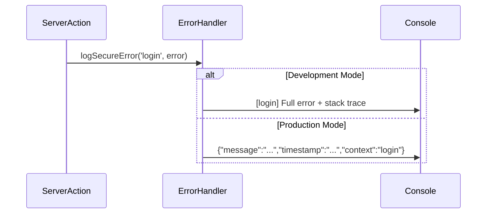

# Error Handling and Information Disclosure Design Document

**Issue:** #17 - [HIGH] Error Handling and Information Disclosure
**Date:** 2026-01-26
**Severity:** HIGH
**Status:** Design Phase

## Overview

Implement a secure error logging utility to prevent sensitive data disclosure in authentication Server Actions. Replace `console.error()` calls with a secure handler that sanitizes information in production logs while preserving debugging details in development.

## Problem Statement

Server Actions currently log full error objects using `console.error()`, which exposes sensitive information in production logs including:
- Database schema (table names, column structures)
- SQL query strings (revealing business logic)
- File paths (server directory structure)
- Stack traces (code organization and library details)

**Example of vulnerable logging:**
```typescript
catch (error) {
  console.error('Failed to create transaction:', error);
  // Logs full Error object with stack trace, file paths, etc.
}
```

## Solution Architecture

### Approach: Secure Error Logging Utility

Create a centralized `logSecureError()` function that differentiates logging behavior based on `NODE_ENV`:

- **Development mode:** Full error details (message, stack trace, context)
- **Production mode:** Sanitized error object (message, timestamp, context only)

### Components

1. **Secure Error Handler** (`lib/utils/error-handler.ts`)
   - `logSecureError(context: string, error: unknown): void`
   - Sanitizes error data based on environment
   - JSON serialization for production logs
   - Maintains debugging capabilities in development

2. **Integration Points** (focused scope)
   - `lib/actions/auth.ts` - login and logout Server Actions
   - Replaces existing `console.error()` calls where they exist
   - Adds logging to error handling paths that currently lack it

### Data Flow



### Security Properties

**Pre-migration vulnerabilities:**
- ❌ Database schema exposed in logs
- ❌ SQL queries visible in error traces
- ❌ File paths reveal server structure
- ❌ Stack traces expose implementation details

**Post-migration security:**
- ✅ Production logs contain only message + timestamp + context
- ✅ Database internals redacted
- ✅ File paths removed
- ✅ Stack traces excluded from production
- ✅ Development retains full debugging capability

### Sanitization Rules

| Field | Development | Production |
|-------|-------------|------------|
| Error message | ✅ Full | ✅ Full |
| Stack trace | ✅ Full | ❌ Excluded |
| File paths | ✅ Full | ❌ Excluded |
| Database errors | ✅ Full | ❌ Message only |
| Context label | ✅ Full | ✅ Full |
| Timestamp | ❌ N/A | ✅ Added |

### Example Log Comparison

**Development mode output:**
```
[login] Error: Authentication failed
[login] Stack: Error: Authentication failed
    at verifyPassword (/home/ubuntu/workspace/maka-admin-panel/lib/auth/password.ts:45:20)
    at login (/home/ubuntu/workspace/maka-admin-panel/lib/actions/auth.ts:35:15)
```

**Production mode output:**
```json
{"message":"Authentication failed","timestamp":"2026-01-26T10:30:00.000Z","context":"login-auth-error"}
```

## Implementation Scope

### In Scope
- Create secure error handler utility
- Apply to `lib/actions/auth.ts` (login/logout Server Actions)
- Add logging to error paths that currently lack it
- Unit tests for error handler
- E2E tests for authentication error handling
- Documentation for error logging best practices

### Out of Scope
- Other Server Actions (transactions, accounts, categories)
- Client-side error displays (separate concern)
- Database driver-level error logging
- Error monitoring integration (Sentry, etc.)
- Structured logging (JSON in development)

### Focus Rationale

**Why only authentication actions?**
- **Highest risk:** Authentication failures expose sensitive authentication mechanisms
- **Minimal impact:** Small changes, focused testing surface
- **Fast deployment:** Can ship independently without affecting other features
- **Easy rollback:** Single revert if issues arise

**Future expansion:**
- Apply to transactions, accounts, categories actions
- Consider structured logging (JSON in all environments)
- Integrate error monitoring (Sentry, LogRocket)
- Add error correlation IDs

## Testing Strategy

### Unit Tests

**File:** `__tests__/utils/error-handler.test.ts`

- Development mode includes stack trace in output
- Production mode excludes stack trace
- JSON serialization works for Error objects
- JSON serialization works for string errors
- JSON serialization works for unknown object errors
- Context label included in both modes
- Timestamp included in production mode

### Integration Tests

**File:** `__tests__/actions/auth.test.ts`

- Authentication errors logged with secure handler
- Logout errors logged with secure handler
- Error messages remain generic to end users
- No sensitive data in error responses

### E2E Tests

**File:** `e2e/error-handling.spec.ts`

- Login failures during network errors
- Logout failures during session errors
- Verify error responses don't contain stack traces
- Verify logs are sanitized in production mode
- Verify development logs contain full details

## Migration Plan

### Pre-deployment
1. Review existing error handling in `lib/actions/auth.ts`
2. Identify all `console.error()` calls (currently none, but add where needed)
3. Identify error paths that lack logging

### Deployment
1. Create `lib/utils/error-handler.ts`
2. Update `lib/actions/auth.ts`
3. Deploy to staging
4. Verify authentication flow works normally
5. Check staging logs for sanitized format
6. Deploy to production

### Post-deployment
1. Monitor production logs for expected format
2. Verify no sensitive data in error logs
3. Check log aggregation systems
4. Validate debugging still possible via development logs
5. Review authentication error rates

## Performance Impact

**Overhead:**
- Function call overhead (negligible)
- JSON serialization in production (minimal, <1ms)
- Only affects authentication paths (not high-frequency operations)

**Estimated impact:**
- Login latency: +0-1ms (unnoticeable)
- Logout latency: +0-1ms (unnoticeable)
- Memory: Negligible (no additional state)

## Alternatives Considered

### Option 1: Apply to All Server Actions
- **Pros:** Comprehensive protection
- **Cons:** Larger testing surface, slower deployment, higher risk
- **Rejected:** Focused scope for safer deployment

### Option 2: Use Error Monitoring Library (Sentry)
- **Pros:** Automatic sanitization, rich features
- **Cons:** External dependency, configuration overhead, cost
- **Rejected:** Overkill for current needs, adds complexity

### Option 3: Disable Error Logging Entirely
- **Pros:** Eliminates disclosure risk
- **Cons:** No observability, debugging impossible
- **Rejected:** Need visibility for operations

## Success Criteria

- ✅ Authentication errors logged with secure handler
- ✅ Production logs contain only message + timestamp + context
- ✅ Development logs contain full error details with stack trace
- ✅ No stack traces in production logs
- ✅ No file paths in production logs
- ✅ No database internals in production logs
- ✅ All existing tests pass
- ✅ New error handler tests pass
- ✅ Authentication flow unaffected
- ✅ Production deployment with sanitized logs

## Rollback Plan

If issues arise:

1. **Minor issues:** Adjust context labels or sanitization logic, redeploy
2. **Broken logs:** Revert `lib/actions/auth.ts` changes, redeploy
3. **Complete failure:** Delete `lib/utils/error-handler.ts`, revert auth changes

No database changes, so rollback is non-destructive. Authentication continues working with previous logging behavior.

## References

- Design Document: `docs/plans/2026-01-26-error-handling-design.md`
- Issue: #17 - [HIGH] Error Handling and Information Disclosure
- OWASP Logging Cheatsheet: https://cheatsheetseries.owasp.org/cheatsheets/Logging_Cheat_Sheet.html
- CWE-209: Generation of Error Message Containing Sensitive Information
