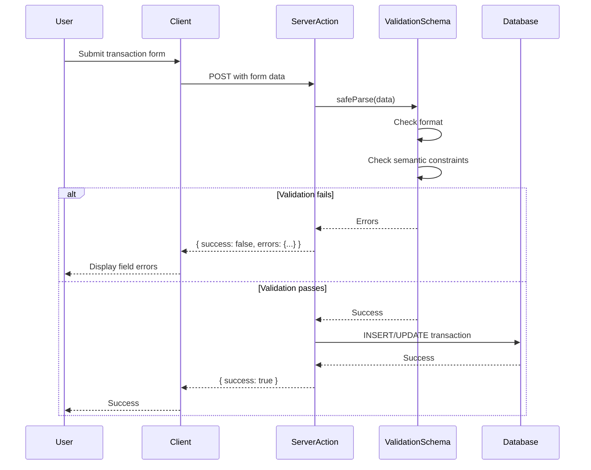

# Input Validation Improvements Design Document

**Issue:** #18 - [HIGH] Input Validation Improvements
**Date:** 2026-01-26
**Severity:** HIGH
**Status:** Design Phase

## Overview

Enhance input validation in transaction forms to enforce business logic constraints. Add semantic validation for transaction amounts and dates to prevent data manipulation and ensure data integrity.

## Problem Statement

Current transaction validation only checks basic format:
- **Amount:** Regex for decimal format only, no range limits
- **Date:** Regex for YYYY-MM-DD format only, no temporal constraints

This allows:
- Extreme financial values (theoretical limits)
- Transactions in the future (phantom data)
- Transactions older than 10 years (manipulation of ancient records)

**Current validation:**
```typescript
date: z.string().regex(/^\d{4}-\d{2}-\d{2}$/, 'Invalid date format'),
amount: z.string().regex(/^-?\d+(\.\d{1,2})?$/, 'Invalid amount'),
```

## Solution Architecture

### Approach: Enhanced Zod Schema Validation

Add semantic validation layers to existing `transactionSchema` using Zod's `.refine()` method to enforce business rules while maintaining user-friendly error messages.

### Components

1. **Enhanced Transaction Schema** (`lib/validations/transactions.ts`)
   - **Amount validation:** Numeric range of -1,000,000.00 to +1,000,000.00
   - **Date validation:** Within last 10 years, not in future
   - Preserves existing format validation
   - Clear, specific error messages for users

2. **Integration Points**
   - `lib/actions/transactions.ts` - `createTransaction`, `updateTransaction` Server Actions
   - Client components that use transaction forms
   - No code changes required in actions or components (schema automatically enforced)

### Validation Rules

| Field | Format Validation | Semantic Validation | Error Message |
|-------|-------------------|---------------------|---------------|
| `date` | YYYY-MM-DD regex | Within last 10 years, ≤ today | "Date must be within last 10 years and not in the future" |
| `amount` | Decimal with 1-2 places | Between -1,000,000 and +1,000,000 | "Amount must be between -1,000,000.00 and 1,000,000.00" |

### Data Flow



### Security Properties

**Pre-migration vulnerabilities:**
- ❌ No limits on transaction amounts
- ❌ Future dates allowed (phantom data)
- ❌ Ancient dates allowed (data manipulation)
- ❌ Potential for fraud via extreme values

**Post-migration security:**
- ✅ Transaction amounts bounded to reasonable limits
- ✅ Future transactions prevented
- ✅ Ancient transaction creation blocked
- ✅ Clear validation prevents data quality issues

### Edge Cases

| Scenario | Validation Result | Reason |
|----------|------------------|--------|
| Amount = 1,000,000.00 | ✅ Valid | At upper limit |
| Amount = 1,000,000.01 | ❌ Invalid | Exceeds limit |
| Amount = -1,000,000.00 | ✅ Valid | At lower limit |
| Amount = -1,000,000.01 | ❌ Invalid | Exceeds limit |
| Date = today | ✅ Valid | Current date |
| Date = tomorrow | ❌ Invalid | Future date |
| Date = 10 years ago | ✅ Valid | At lower limit |
| Date = 10 years + 1 day | ❌ Invalid | Exceeds limit |

## Implementation Scope

### In Scope
- Enhance `transactionSchema` with amount range validation
- Enhance `transactionSchema` with date range validation
- Add unit tests for validation rules
- Add E2E tests for form validation UX
- Update validation documentation

### Out of Scope
- Other schemas (accounts, categories, auth)
- Database-level constraints (check constraints)
- Configurable limits per user/account
- Admin override functionality
- Historical data validation (existing transactions)

### Focus Rationale

**Why only transactions?**
- **Highest risk:** Financial data manipulation
- **Direct impact:** Transactions are core business logic
- **Clear business rules:** Amount and date limits have obvious constraints
- **Low complexity:** Single schema modification

**Future expansion:**
- Apply similar validation to accounts, categories
- Add database check constraints for defense in depth
- Implement per-account limits
- Add admin workflow for exceptions

## Testing Strategy

### Unit Tests

**File:** `__tests__/validations/transactions.test.ts`

- Amount validation rejects > 1,000,000
- Amount validation accepts = 1,000,000 (edge case)
- Amount validation rejects < -1,000,000
- Amount validation accepts = -1,000,000 (edge case)
- Date validation accepts today
- Date validation rejects tomorrow
- Date validation rejects 10 years + 1 day ago
- Date validation accepts 10 years ago (edge case)
- Multiple validation errors show all failures
- Error messages are specific and user-friendly
- Invalid formats still caught by regex

### E2E Tests

**File:** `e2e/input-validation.spec.ts`

- Form prevents submission of amount = 1,000,000.01
- Form allows submission of amount = 1,000,000.00
- Form prevents submission of future date
- Form prevents submission of date > 10 years old
- Form shows specific error messages for each field
- Valid transaction (within limits) submits successfully
- Form highlights invalid fields with error text

### Integration Tests

Verify Server Actions:
- `createTransaction` rejects invalid amounts with validation errors
- `updateTransaction` rejects invalid dates with validation errors
- Valid transactions proceed to database successfully
- Validation errors returned in expected format

## Migration Plan

### Pre-deployment
1. Review existing transactions in database
2. Identify any transactions outside new limits (for monitoring)
3. Communicate changes to team

### Deployment
1. Deploy enhanced validation schema
2. Monitor form submission error rates
3. Check for legitimate use cases incorrectly blocked
4. Adjust limits if needed

### Post-deployment
1. Monitor validation error patterns
2. Update user documentation with new constraints
3. Consider adding admin workflow for exceptions

## Impact Assessment

### Breaking Changes

**None.** The changes only affect new transaction submissions. Existing transactions in the database remain unchanged and can still be viewed.

### User Impact

**Minimal.** Most users won't notice:
- Typical transactions (< $100k) unaffected
- Normal dating (last few years) unaffected
- Only edge cases blocked (extreme values, very old dates)

### Performance Impact

**Negligible:**
- Additional validation logic: <1ms per transaction
- No database query overhead (pure calculation)
- Unnoticeable in UI response times

## Alternatives Considered

### Option 1: Database Check Constraints
- **Pros:** Enforced at all access points
- **Cons:** Schema migration, harder to change, less flexible error messages
- **Rejected:** Application layer sufficient for MVP, can add later

### Option 2: Configurable Limits
- **Pros:** Flexible for different use cases
- **Cons:** Adds complexity, requires configuration management
- **Rejected:** Start with hardcoded limits, make configurable if needed

### Option 3: No Limits (Current State)
- **Pros:** Maximum flexibility
- **Cons:** No protection against data manipulation
- **Rejected:** Security risk outweighs flexibility

## Success Criteria

- ✅ Transaction amounts bounded to -1,000,000 to +1,000,000
- ✅ Transaction dates bounded to last 10 years, not future
- ✅ Edge cases (+/- 1,000,000, exactly 10 years ago, today) validated correctly
- ✅ Clear, specific error messages for users
- ✅ All existing tests pass
- ✅ New validation tests pass (100% coverage)
- ✅ New E2E tests pass
- ✅ Production deployment with no disruption
- ✅ Minimal validation error rate (legitimate transactions pass)

## Rollback Plan

If issues arise:

1. **Legitimate use cases blocked:** Increase limits (e.g., to 10M) and redeploy
2. **Too many validation errors:** Relax date constraint (e.g., 20 years) and redeploy
3. **Complete failure:** Revert schema changes to allow unlimited amounts/dates

No database changes, so rollback is non-destructive. Existing transactions remain valid regardless of limits.

## References

- Design Document: `docs/plans/2026-01-26-input-validation-design.md`
- Issue: #18 - [HIGH] Input Validation Improvements
- CWE-20: Improper Input Validation
- OWASP Input Validation: https://cheatsheetseries.owasp.org/cheatsheets/Input_Validation_Cheat_Sheet.html
