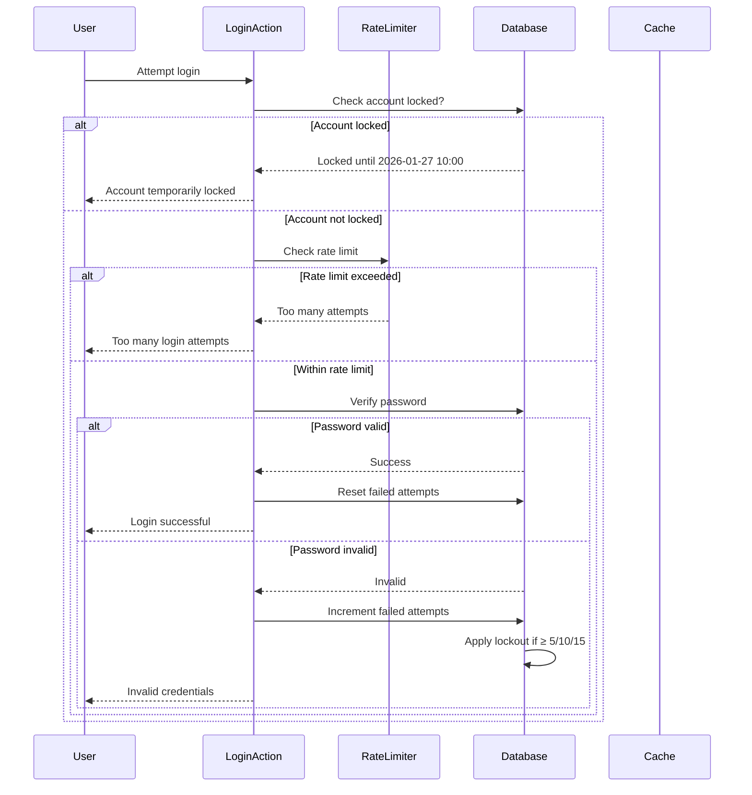

# Rate Limiting and Brute Force Protection Design Document

**Issue:** #14 - [CRITICAL] Missing Rate Limiting and Brute Force Protection
**Date:** 2026-01-26
**Severity:** CRITICAL
**Status:** Design Phase

## Overview

Implement rate limiting and progressive account lockout mechanisms to protect authentication endpoints from brute-force attacks, credential stuffing, and distributed account takeover attempts.

## Problem Statement

The authentication endpoint (`lib/actions/auth.ts`) lacks protection against:

1. **No rate limiting:** Unlimited login attempts without throttling
2. **No account lockout:** Repeated failed attempts don't trigger lockouts
3. **No distributed attack protection:** Multiple IPs can attack same account bypassing IP-based limits
4. **No progressive deterrents:** Escalating consequences for repeated attacks

### Attack Scenarios

**Brute-force attack:**
```bash
# Attacker attempts 1000 passwords per minute from single IP
for pwd in $(wordlist.txt); do curl -X POST http://app.com/login -d "username=admin&password=$pwd"; done
```

**Credential stuffing:**
```bash
# Attacker uses 100 different IPs (botnet) to test leaked credentials
# Each IP tries 5 passwords, cumulative 500 attempts against account
# Without account-level lockout, this bypasses IP-based rate limiting
```

**Distributed account takeover:**
```bash
# Attackers coordinate from multiple locations
# Each tries one password, but collectively test many combinations
# Without per-account lockout, they can continue indefinitely
```

## Solution Architecture

### Approach: Two-Layer Protection

**Layer 1: Rate Limiting (IP-based, immediate)**
- In-memory LRU cache tracks login attempts per IP
- 5 attempts per minute per IP
- 10 attempts per minute per user+IP combination
- Automatic expiration after 60 seconds

**Layer 2: Account Lockout (user-based, persistent)**
- Database tracks cumulative failed attempts per user
- Progressive lockout: 5/10/15 failed attempts → 5min/30min/24hr lockouts
- Lockout persists in database (survives server restarts)
- Resets on successful login

### Components

1. **Rate Limiter** (`lib/auth/rate-limit.ts`)
   - LRU cache with 500 max entries, 60s TTL
   - `checkRateLimit(identifier, maxAttempts, windowMs)` function
   - Dual tracking: per-user+IP and per-IP

2. **Account Lockout Logic** (`lib/auth/account-lockout.ts`)
   - `isAccountLocked(userId)` - check lock status
   - `incrementFailedAttempts(userId)` - increment counter, apply lockout
   - `resetFailedAttempts(userId)` - clear on success
   - Database columns: `failed_login_attempts`, `locked_until`

3. **Enhanced Login Action** (`lib/actions/auth.ts`)
   - Check account lockout first (fast DB query)
   - Check rate limit (fast cache lookup)
   - Verify password (existing bcrypt logic)
   - Reset/increment failed attempts
   - Return lockout expiration times to users

### Database Schema Changes

```sql
ALTER TABLE users
  ADD COLUMN IF NOT EXISTS failed_login_attempts INTEGER DEFAULT 0,
  ADD COLUMN IF NOT EXISTS locked_until TIMESTAMP;

CREATE INDEX IF NOT EXISTS idx_users_locked_until
  ON users(locked_until) WHERE locked_until IS NOT NULL;
```

### Data Flow



### Progressive Lockout Rules

| Failed Attempts | Lock Duration | Rationale |
|----------------|---------------|-----------|
| 5 | 5 minutes | Initial deterrent, allows quick reset |
| 10 | 30 minutes | Moderate deterrent for persistent attacks |
| 15 | 24 hours (1440 minutes) | Strong deterrent, requires admin intervention |
| Reset | 0 | Successful login clears counter |

### Rate Limiting Thresholds

| Metric | Threshold | Window | Key |
|--------|-----------|--------|-----|
| User+IP attempts | 5 | 60s | `login:${username}:${ip}` |
| IP-only attempts | 10 | 60s | `login:${ip}` |

Dual keys prevent:
- Credential stuffing (same IP, different accounts)
- Distributed attacks against single account (different IPs, same username)

### Security Properties

**Before:**
- ❌ Unlimited login attempts
- ❌ No account lockout
- ❌ Vulnerable to brute-force
- ❌ Vulnerable to credential stuffing

**After:**
- ✅ Rate limiting per IP (5 attempts/minute)
- ✅ Rate limiting per user+IP (10 attempts/minute)
- ✅ Progressive account lockout (5min/30min/24hr)
- ✅ Persistent protection (database)
- ✅ Fast enforcement (cache)

### Limitations and Mitigations

| Limitation | Mitigation |
|------------|------------|
| In-memory cache lost on server restart | Database lockout remains persistent |
| Large botnet can exhaust cache (500 entries) | Account lockout still works via DB |
| Legitimate users can lock themselves out | Support unlocks via admin tools |
| Rate limit doesn't prevent distributed locks | Account lockout handles this |

## Implementation Scope

### In Scope
- Create `lib/auth/rate-limit.ts` with LRU cache
- Create `lib/auth/account-lockout.ts` with lockout logic
- Database migration to add lockout columns
- Enhance `lib/actions/auth.ts` with rate limiting and lockout checks
- Unit tests for rate limiter and lockout logic
- E2E tests for brute-force prevention
- Update documentation

### Out of Scope
- CAPTCHA integration (future enhancement)
- IP blocking (future enhancement)
- Email notifications on lockouts (future enhancement)
- Admin dashboard for lockout management (future enhancement)
- Distributed rate limiting (Redis) - in-memory sufficient for MVP

## Testing Strategy

### Unit Tests
- Rate limiter prevents >5 attempts within TTL
- Rate limiter resets after TTL expires
- Rate limiter tracks separate counters for different identifiers
- Account lockout triggers at 5/10/15 failed attempts
- Lockout prevents login until expiration
- Password reset or successful login clears lockout

### Integration Tests
- Multiple failed logins trigger rate limit
- Distributed attack (multiple IPs) triggers account lockout
- Account locked from one IP cannot login from another
- Successful login resets failed counter
- Lockout expiration allows retry

### E2E Tests
- Brute-force attack simulation (6 rapid failed logins)
- Distributed attack simulation (multiple IPs, cumulative lockout)
- Normal login flow unaffected
- Lockout states persist across page reloads
- Rate limiting prevents login spamming

## Migration Plan

### Pre-deployment
1. Database backup (precaution, though migration is safe)
2. Run migration in staging: `psql $DATABASE_URL -f lib/db/migrations/002_add_account_lockout.sql`
3. Test authentication flow with staging credentials
4. Verify existing users start with `failed_login_attempts = 0`

### Deployment
1. Deploy rate limiting and lockout code
2. Monitor failed login attempts and lockouts via logs
3. Tune rate limiting thresholds based on legitimate traffic
4. Provide user communication about lockout policy
5. Set up admin workflow for manual account unlocks

### Rollback
1. Remove rate limiting code (revert auth.ts changes)
2. Database columns remain (no impact)
3. Locked accounts may need manual password reset
4. Or roll back migration (drop columns) if needed

## Alternatives Considered

### Option 1: Redis for Rate Limiting
- **Pros:** Distributed, persistent, scales horizontally
- **Cons:** External dependency, infrastructure cost, complexity
- **Rejected:** In-memory LRU sufficient for MVP

### Option 2: CAPTCHA Instead of Rate Limiting
- **Pros:** Prevents automated attacks entirely
- **Cons:** Bad user experience, additional service dependency
- **Rejected:** Poor UX, rate limiting more friendly

### Option 3: IP-Only Lockout (No Progressive)
- **Pros:** Simpler implementation
- **Cons:** Bypassed by distributed attacks (botnets)
- **Rejected:** Doesn't protect against credential stuffing

## Success Criteria

- ✅ Login attempts rate limited to 5/minute per user+IP
- ✅ Account lockout at 5/10/15 failed attempts (5min/30min/24hr)
- ✅ Generic error messages prevent enumeration
- ✅ All existing tests pass
- ✅ New rate limiter tests pass
- ✅ New lockout tests pass
- ✅ E2E tests prevent brute-force attacks
- ✅ Database migration runs successfully
- ✅ Production deployment with monitoring

## Rollback Plan

If issues arise:

1. **Immediate:** Remove rate limiting code, keep database columns (no impact)
2. **Accounts locked:** Manually reset `failed_login_attempts` and `locked_until` via SQL
3. **Complete rollback:** Revert code commit + drop database columns

For locked users:
```sql
UPDATE users SET failed_login_attempts = 0, locked_until = NULL WHERE id = <locked_user_id>;
```

## References

- Issue: #14 - [CRITICAL] Missing Rate Limiting and Brute Force Protection
- CWE-307: Improper Restriction of Excessive Authentication Attempts
- OWASP Authentication Cheat Sheet: https://cheatsheetseries.owasp.org/cheatsheets/Authentication_Cheat_Sheet.html
- OWASP Brute Force Protection: https://cheatsheetseries.owasp.org/cheatsheets/Brute_Force_Prevention_Cheat_Sheet.html
